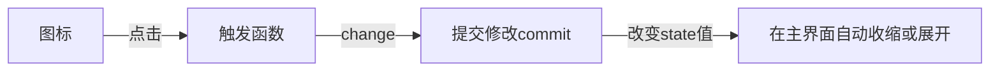

# 后台管理页面制作学习过程：
# 工程基础配置：
vue3+ts+vite


课程地址：https://www.bilibili.com/video/BV1SP4y187r2

一.新建工程

npm init vite@latest  --使用vite构建

npm inti vue@latest --使用vue构建


二.安装vue-router

1.npm install vue-router@4

2.src新建目录router，新建index.ts

~~~typescript
import { createRouter,createWebHistory,RouteRecordRaw } from 'vue-router'
import Layout from '../components/HelloWorld.vue'

//路由列表
const routes:Array<RouteRecordRaw> = [
    {
        path:'/',
        name:'home',
        component:Layout
    }
]

//创建路由
const router = createRouter({
    history:createWebHistory(),
    routes
})

//暴露属性
export default router
~~~

3.在main.ts中使用路由

~~~typescript
import { createApp } from 'vue'
import './style.css'
import App from './App.vue'
//新增路由
import router from './router'

//新增.use(router)
createApp(App).use(router).mount('#app')
~~~

三.安装vuex “全局模式保存变量等”

1.安装

```typescript
npm install vuex@next --save
```

2.src下新建目录store，新建index.ts

~~~typescript
// store.ts
import { InjectionKey } from 'vue'
import { createStore, useStore as baseUseStore, Store } from 'vuex'

export interface State {
  count: number
}

export const key: InjectionKey<Store<State>> = Symbol()

export const store = createStore<State>({
  state: {
    count: 0
  }
})

// 定义自己的 `useStore` 组合式函数
export function useStore () {
  return baseUseStore(key)
}
~~~

3.main.ts使用vuex

~~~typescript
import { createApp } from 'vue'
import './style.css'
import App from './App.vue'
// 新增路由
import router from './router'
// 新增vuex
import { store,key } from './store'

// 新增.use(router)
createApp(App).use(router).use(store,key).mount('#app')
~~~

4.题外话：tsconfig.json 里配置

~~~typescript
 // ts排除文件node_modules
 "exclude": ["node_modules"]
~~~

四.安装ESlint 代码检查工具

~~~typescript
npm install -save-dev eslint eslint-plugin-vue
~~~

五.安装sass

~~~ty
npm install -D sass sass-loader
~~~


# 准备阶段：

## 1.安装ElementPlus

~~~typescript
npm i element-plus --save
~~~

## 2.引入-按需引入,先安装两款插件

~~~typescript
npm install -D unplugin-vue-components unplugin-auto-import
~~~

vite.config.ts 导入配置

~~~typescript
// vite.config.ts
import { defineConfig } from 'vite'
import AutoImport from 'unplugin-auto-import/vite'
import Components from 'unplugin-vue-components/vite'
import { ElementPlusResolver } from 'unplugin-vue-components/resolvers'

export default defineConfig({
  // ...
  plugins: [
    // ...
    AutoImport({
      resolvers: [ElementPlusResolver()],
    }),
    Components({
      resolvers: [ElementPlusResolver()],
    }),
  ],
})
~~~

# 布局阶段：

## 前提：.vue文件基础模板：

~~~html
<script setup lang="ts">
</script>


<template>
</template>


<style lang="scss" scoped>
</style>

~~~


## 1.开始布局后台管理系统界面

src创建Layout目录，创建index.vue文件

~~~html
<template>
    <div class="layout">
      <el-container class="container">
        <el-aside width="200px" class="aside">侧边栏</el-aside>
        <el-container>
          <el-header class="header">顶部栏</el-header>
          <el-main class="main">
            <div>
                主体内容
                <a href="https://vitejs.dev" target="_blank">
                    
                </a>
                <a href="https://vuejs.org/" target="_blank">
                    
                </a>
            </div>
          </el-main>
          <el-footer class="footer">底部区域</el-footer>
        </el-container>
      </el-container>
    </div>
</template>


<style lang="scss" scoped>
.layout{
  height: 100%;
  .container{
    height: 100%;
  }
  .aside{
    background-color: blue;
  }
  .header{
    background-color: azure;
  }
  .main{
    background-color: ghostwhite;
  }
  .footer{
    background-color: darkgray;
  }
}
</style>
~~~

记得项目入口index.html设置00

~~~css
<style>
  html,body,#app{
    padding: 0px;
    margin: 0px;
    height: 100%;
  }
</style>
~~~

## 2.Layout目录入口

继续创建menu，header，main，footer 组件文件夹，分离制作侧边栏菜单：

### 2.1 menu制作

~~~typescript
// AsideMenuBar.vue 侧边管理菜单栏父组件
<script setup lang="ts">
import { reactive, ref } from 'vue'
import MenuItem from './MenuItem.vue'


const isCollapse = ref(false)
const handleOpen = (key: string, keyPath: string[]) => {
  console.log(key, keyPath)
}
const handleClose = (key: string, keyPath: string[]) => {
  console.log(key, keyPath)
}
let menuList= reactive([
    { 
        /*   菜单传入参数
         *   path ：路径
             component: 来自组
             meta： 主要内容
             meta.title :菜单标题
             meta.icon: 菜单使用图标名字
             roles：规则组，暂时未知用法
             parentId: 当前为菜单级别
             children： 子菜单
             	...
         */
        path:'/dashboard',
        component:'Layout',
        meta:{
            title:"首页",
            icon:"HomeFilled",
            roles:["sys:manage"]
        },
        children:[]
    },
    {
        path:'/system',
        component:'Layout',
        alwaysShow:true,
        meta:{
            title:"系统管理",
            icon:"Tools",
            roles:["sys:manage"],
            parentId:0,
        },
        children:[
            {
                path:'/department',
                component:'/system/department/department',
                alwaysShow:false,
                meta:{
                    title:"部门管理",
                    icon:"OfficeBuilding",
                    roles:["sys:dept"],
                    parentId:17,
                }
            },
        ]
    },
]);

</script>

<template>
    <el-menu
      default-active="2"
      class="el-menu-vertical-demo"
      :collapse="isCollapse"
      @open="handleOpen"
      @close="handleClose"
    >
        <MenuItem :menuList="menuList"></MenuItem>
    </el-menu>
</template>

<style lang="scss" scoped>

</style>

~~~

考虑到获取的菜单内容也是从后端传入，单独将菜单内容也组件分离

父组件引入<MenuItem :menuList="menuList"></MenuItem>

新建MenuItem.vue,子组件使用

~~~typescript
definProps('menuList')
~~~

~~~typescript
<script setup lang="ts">
// 引入图标
import {
  Document,
  Menu as IconMenu,
  Location,
  Setting,
} from '@element-plus/icons-vue'

</script>


// 静态模板，之后需要修改成动态获取
<template>
    <el-sub-menu index="1">
      <template #title>
        <el-icon><location /></el-icon>
        <span>Navigator One</span>
      </template>
      <el-sub-menu index="1-2">
        <template #title><span>item One</span></template>
        <el-menu-item index="1-2-1">item one</el-menu-item>
      </el-sub-menu>
    </el-sub-menu>

    <el-menu-item index="2">
      <el-icon><icon-menu /></el-icon>
      <template #title>Navigator Two</template>
    </el-menu-item>
</template>


<style lang="scss" scoped>
</style>
 
~~~

修改成动态获取菜单：

~~~html
<script setup lang="ts">

//引入父组件数据
defineProps(['menuList'])
</script>

<template>

    <!-- 菜单模板，获取数据后循环打印渲染菜单,用路径当key值，不会出错 -->
    <template v-for="menu in menuList" :key="menu.path">

        <!-- 如果菜单中还有子菜单大于0个，使用此模板 -->
        <el-sub-menu v-if="menu.children && menu.children.length > 0" :index="menu.path">
            <template #title>
                <!-- 名字图标引入 -->
                <el-icon>
                    <component :is="menu.meta.icon" class="icon"></component>
                </el-icon>
                <span>{{ menu.meta.title }}</span>
            </template>

            <!-- 子菜单直接递归迭代显示 -->
            <menu-item :menuList="menu.children"></menu-item>
        </el-sub-menu>

        <!-- 如果没有子菜单的目录，使用此模板 -->
        <el-menu-item v-else :index="menu.path">
            <!-- 名字图标引入 -->
            <el-icon>
                <component :is="menu.meta.icon" class="icon"></component>
            </el-icon>
            <template #title>{{ menu.meta.title }}</template>
        </el-menu-item>
    </template>
</template>


<style lang="scss" scoped>

</style>
 
~~~

菜单logo页面制作

~~~html
<script setup lang="ts">
import { computed } from 'vue'
import { useStore } from '../../store'

const store = useStore()
const isCollapse = computed(()=>{
    return store.getters['getCollapse']

}) 
</script>

<template>
    <div class="logo">
        
        <span v-if="!isCollapse">Vite Vue</span>
    </div>
</template>

<style lang="scss" scoped>
.logo{
    height: 50px;
    line-height: 50px;
    display: flex;
    text-align: center;
    align-items: center;
    padding-left: 15px;
    background: #fff800;
    img{
        width: 32px;
        height: 32px;
        margin-right: 12px;
    }
    
}
</style>
~~~

然后在菜单主入口引入logo

~~~html
<template>
    <el-menu
      :default-active="activeIdex"
      class="el-menu-vertical-demo"
      :collapse="isCollapse"
      @open="handleOpen"
      @close="handleClose"
      router="true"
      active-text-color="#ffd04b"
      background-color="#545c64"
      text-color="#fff"
    >
        // AsideMenuBar.vue 在此处引入
    <MenuLogo class="layout-logo"></MenuLogo>
        
    <MenuItem :menuList="menuList"></MenuItem>
    </el-menu>
</template>

~~~

菜单收缩展开功能制作

新建一个vue编写动态图标： 

~~~html
 // 模板和css部分
<template>
    <el-icon @click="change" class="fa-icons">
        
// 动态图标使用三元表达式 boolen类型的status默认是false代表不合闭，
// 即默认是使用闭合的图标，闭合后显示展开图标
        
        <component class="icons" :is="status ? Expand : Fold"/>
    </el-icon>
    
</template>
<style lang='scss' scoped>
.fa-icons{
    display: flex;
    align-items: center;
    font-size: 25px;
    cursor: pointer;
    margin-right: 15px;
}
</style>
~~~

status 默认值为false我们此处选择使用vuex设置为全局模式，在store/index.ts中操作

~~~tsx
// 官方模板
// store.ts
import { InjectionKey } from 'vue'
import { createStore, useStore as baseUseStore, Store } from 'vuex'

export interface myState {
  collapse: boolean
}

export const key: InjectionKey<Store<myState>> = Symbol()

export const store = createStore<myState>({
  state: {
    collapse:false
  },
  mutations:{
    setCollapse:(state:myState,collapse:boolean)=>{
       state.collapse = collapse;
    }
  },
  getters:{
    getCount(state:myState){
        return state.count;
    },
    getCollapse:(state:myState)=>{
        return state.collapse;
    }
  }
})

// 定义自己的 useStore 组合式函数，外部使用时直接import { useStore } from '../store'
export function useStore () {
  return baseUseStore(key)
}
~~~

vuex解析：

~~~typescript
//定义一个接口 collapse设置属性为boolean
export interface myState {
  collapse: boolean
}
~~~

~~~typescript
//默认写法不能少,<myState>是自己的接口名
export const key: InjectionKey<Store<myState>> = Symbol()  
~~~

~~~typescript
// 创建方法 设置state为 false
export const store = createStore<myState>({
  state: {
    collapse:false
  },
    
  // 提交事务方法，修改状态的核心代码，更新当前状态
  mutations:{
    setCollapse:(state:myState,collapse:boolean)=>{
       state.collapse = collapse;
    }
  },
  
   // 使用get方法获取当前变量最新状态
  getters:{
    getCollapse:(state:myState)=>{
        return state.collapse;
    }
  }
})
~~~

公共部分完成后继续 图标的ts编写

~~~typescript
<script setup lang='ts'>
import { ref,computed } from 'vue'

// 引入展开和闭合的图标
import { Expand, Fold } from "@element-plus/icons-vue"

// 引入 vuex 和自定义的store
import { useStore } from '../../store';

// 使用 useStore()
// 用useStore()中的getter功能获取当前的值
const store = useStore()
const status = computed(()=>{
    return store.getters['getCollapse']
}) 
// 需要修改时使用
const change = ()=>{
    store.commit('setCollapse',!status.value)
}
</script>
~~~
最后修改菜单主入口js函数代码
~~~typescript
<script setup lang="ts">
import { reactive,computed } from 'vue'
import { useRoute } from 'vue-router';
import MenuItem from './MenuItem.vue'
import MenuLogo from './MenuLogo.vue';
import { useStore } from '../../store';

// 此处监听collapse值，用computed()计算展示
const store = useStore()
const isCollapse = computed(()=>{
    return store.getters['getCollapse']

}) 
~~~

操作成功流程



动态路由制作，router/index.ts 中创建路由列表

~~~typescript
import { createRouter,createWebHistory,RouteRecordRaw } from 'vue-router'
import Layout from '../Layout/index.vue'

// 路由列表
const routes:Array<RouteRecordRaw> = [
    // 首页路由，直接跳转到dashboard
    {
        path: '/',
        name: 'home',
        component: Layout,
        redirect: '/dashboard',
        children: [
            {
                path:'/dashboard',
                component: () => import('../Layout/Dashboard/index.vue'),
                name: 'dashboard',
                meta: {
                    title: "首页",
                    icon: "HomeFilled"
                }
            }
        ]
    },
    // 系统管理页面路由
    {
        path: '/system',
        name: 'system',
        component: Layout,
        meta:{
            title: "系统管理",
            icon: "Tools",
            roles:["sys:manage"],
            parentId:0,
        },
        children: [
            {
                path:'/department',
                component: () => import('../Layout/System/department/department.vue'),
                name: 'department',
                meta: {
                    title: "部门管理",
                    icon: "OfficeBuilding",
                    roles:["sys:dept"],
                },
            },
            {
                path:'/userlevel',
                component: () => import('../Layout/System/user/userlevel.vue'),
                name: 'userlevel',
                meta: {
                    title: "权限管理",
                    icon: "Tools",
                    roles:["sys:level"],
                },
            },
        ]
    }
]

// 创建路由
const router = createRouter({
    history:createWebHistory(),
    routes
})

// 暴露属性
export default router
~~~

在主框架上把路由添加到main区域中

~~~html
<template>
    <div class="layout">
      <el-container class="container">
        <el-aside width="auto" class="aside">
          <Menu></Menu>
        </el-aside>
        <el-container>
          <el-header class="header">
            <Header></Header>
          </el-header>
          <el-main class="main">
              // 添加路由组件即可在main区域显示画面
            <router-view></router-view>
          </el-main>
          <el-footer class="footer">
            <Footer></Footer>
          </el-footer>
        </el-container>
      </el-container>
    </div>
</template>
~~~

### 2.2 面包屑导航

### 2.3 Tabs标签页面


## 3.axion接入

3.1 安装
~~~typescript
npm i axios
~~~
3.2 axios基础配置

   （1）.配置basurl，前置拦截器（发起请求之前的拦截），后置拦截器（获取到响应时的拦截）
   （2）.封装请求，一般封装”服务器返回数据的格式“，request的四个请求，由于是typescript语法，需要给类型：
   ~~~typescript
   import service from './service'
import type { InternalAxiosRequestConfig } from 'axios'
 
// 服务器返回数据的格式
interface Result<T = {}> {
    code: number,
    message: string,
    data: T
  }

// 自定义返回类型
export type PromiseRes<T> = Promise<Result<T>>


// 封装请求方法
export const http = {
    get<T=any>(url: string, config?: InternalAxiosRequestConfig) : PromiseRes<T> {
      return service.get(url, config)
    },
   
    post<T=any>(url: string, data?: object, config?: InternalAxiosRequestConfig) :PromiseRes<T> {
      return service.post(url, data, config)
    },
   
    put<T=any>(url: string, data?: object, config?: InternalAxiosRequestConfig) :PromiseRes<T> {
      return service.put(url, data, config)
    },
   
    delete<T=any>(url: string, config?: InternalAxiosRequestConfig) : PromiseRes<T> {
      return service.delete(url, config)
    }
  }
   ~~~

